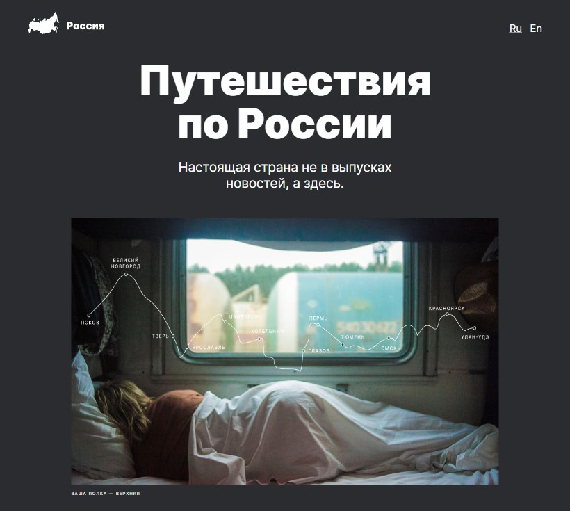

# [Yandex Practicum](https://practicum.yandex.ru/) | [Путешествие по России](https://smolinartem.github.io/russian-travel/)

---

## О проекте

Вебсайт про интересные места для путешествия по России. На сайте есть галерея фотографий красивых мест, краткое описание туристических локаций и ссылки на сайты с более подробной информацией по каждому месту. Также в footer можно найти полезные ссылки на сервисы Yandex, которые могут пригодиться во время путешествия.

## Технологический стек:

- Семантические теги
- Flexbox
- Grid Layout
- Адаптивная верстка с использованием медиа-запросов
- БЭМ Nested
- Псевдоклассы CSS
- Hover эффекты и анимации
- Git
- Переменные CSS

## Ссылки на проект и на макет:

- [Проект на Github Pages](https://smolinartem.github.io/russian-travel/)
- [Макет в Figma](https://www.figma.com/file/5S2WSbEFL6awjVWJ0NWL8Q/Sprint-3_-Russia-_-desktop-%2B-mobile?node-id=28503%3A0&t=hd8pJxxmFZo7Oi6n-0)
